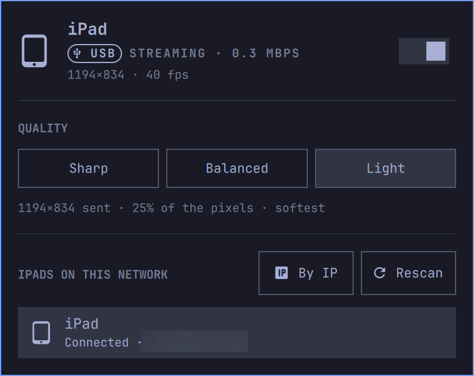

# LeoAba Sidecar for Omarchy

Use an iPad as a second display for [Omarchy](https://omarchy.org), the way macOS Sidecar does. It syncs over **Wi-Fi or a USB-C cable**, and touch works as a mouse.

**Made for Apple Silicon M1 and M2 MacBooks running Omarchy on Asahi Linux.** Their USB-C ports can't drive an external display under Linux yet (no DisplayPort alt mode), so an iPad is the only second screen you can get. Nothing in the code is M1-specific, and it will probably run on other Omarchy machines, but **it has only been tested on a 13" M1 MacBook Pro (2020)** with an 11" iPad Pro. Reports from M2 owners are very welcome.



A bar widget creates a virtual monitor sized to your iPad and streams it to the free **OpenDisplay** app on the iPad. Taps, drags, Apple Pencil and two-finger scroll come back as pointer input. Drag windows onto it, or move a workspace there, like any other monitor.

## Requirements

- Omarchy (Hyprland with Lua config, Quickshell bar).
- On the iPad: [OpenDisplay](https://github.com/peetzweg/opendisplay), free on [TestFlight](https://testflight.apple.com/join/3NYaY11c).
- **Wi-Fi:** the iPad and the computer must be on the same network. Phone hotspots may block device-to-device traffic.
- **USB (optional):** `usbmuxd` (`omarchy pkg add usbmuxd`). After installing it, replug the iPad and tap **Trust**.
- Packages the setup script checks for, and installs with `omarchy pkg add` if any are missing: `wf-recorder`, `avahi`, `wayland`, `gcc`, `make`, `pkgconf`, `python`. [DEPENDENCIES.md](DEPENDENCIES.md) lists every package it uses, with the versions it was tested on.

## Install

```sh
omarchy plugin add https://github.com/LeoAba/leoaba-sidecar --enable
~/.config/omarchy/plugins/io.github.leoaba.sidecar/setup
```

`setup` builds the small touch-input helper (`pointer/`) and links the CLI to `~/.local/bin/omarchy-sidecar`. Nothing else outside the plugin folder is changed.

## Use

1. Open OpenDisplay on the iPad.
2. Click the tablet icon in the bar, then pick the iPad.
   - Right-click the icon to connect to the last iPad, or to disconnect.
3. The iPad appears as a monitor to the right of your screen.
   - The widget shows the connection (**USB** or **Wi-Fi**), the resolution, the frame rate, and the bitrate.

**Quality** switches live while connected. The desktop layout stays the same; only the number of pixels sent changes:

| | Sent (11" iPad Pro) | |
|---|---|---|
| Sharp | 2388×1668 | native pixels, crispest |
| Balanced | 1790×1250 | 56% of the pixels |
| Light | 1194×834 | 25% of the pixels, lightest on the laptop |

**USB:** if the iPad is plugged in, the cable is used automatically. Plug in during a Wi-Fi session and it moves over; unplug and it falls back to Wi-Fi.

**CLI:**

```sh
omarchy-sidecar list                      # iPads on the network
omarchy-sidecar connect [NAME|IP] [--quality sharp|balanced|light] [--usb|--wifi]
omarchy-sidecar quality light             # live
omarchy-sidecar status
omarchy-sidecar stop
```

If Bonjour can't see the iPad (another subnet, Tailscale), use **By IP** in the widget, or run `omarchy-sidecar connect 192.168.x.y`.

## How it works

- **Display:** `hyprctl output create headless` creates the virtual monitor, sized from the iPad's `hello` message.
- **Video:** `wf-recorder` captures the monitor. It's encoded in software (libx264 ultrafast/zerolatency, one slice, no VBV, level 5.1) and sent as H.264 following the [OpenDisplay protocol](https://github.com/peetzweg/opendisplay).
- **Input:** touches arrive as normalized coordinates, and `pointer/sidecar-pointer` (a `zwlr_virtual_pointer` client) replays them on that monitor.
- **USB:** a small built-in usbmuxd client opens the connection to the app over the cable. No `iproxy` needed.

State and a log live in `~/.local/state/omarchy/sidecar*`. The log caps itself at 2 MB.

## Known issues

- **Long sessions slow Hyprland 0.56.2 down. This is the one open problem.** Capturing a virtual monitor for a long time makes Hyprland use more and more CPU. The frame rate drops, and disconnecting can freeze the desktop for a few seconds. Hyprland recovers by itself afterwards.
  - It looks like an upstream screencopy bug that's already fixed ([hyprwm/Hyprland#16361](https://github.com/hyprwm/Hyprland/pull/16361), merged after 0.56.2). I'm waiting for the Hyprland release that includes it, to confirm.
  - **Any help here is very welcome:** if you know this area of Hyprland, have tested a newer build, or have seen the same thing with other screencopy tools, please open an issue. `tools/stall-probe.py` records the stalls.
- **The pointer is drawn into the video,** so it moves at video frame rate rather than touch rate.
- **Software encoding only:** there's no hardware encoder on Asahi. Sharp at 2388×1668 costs about 1–1.5 CPU cores for capture and encoding.

## Uninstall

```sh
~/.config/omarchy/plugins/io.github.leoaba.sidecar/setup --uninstall
omarchy plugin remove io.github.leoaba.sidecar
```

## Development

`tools/fake-receiver.py` stands in for the iPad app, `tools/fake-usbmuxd.py` for a USB-connected iPad, and `tools/stall-probe.py` watches for desktop stalls. `SIDECAR_DUMP=file` saves the exact stream sent; `SIDECAR_X264=":key=value"` appends x264 options.

## Thank you

I'm so happy and grateful to be part of Omarchy, and I really appreciate all the work that's been put into it. Thank you to everyone behind Omarchy, and to Hyprland, Quickshell, Asahi Linux and OpenDisplay, which this plugin stands on. My M1 couldn't use an external monitor, and now it has a second screen again :)

## License

MIT. OpenDisplay is a separate project with its own license; this plugin only talks to it over its published protocol.
